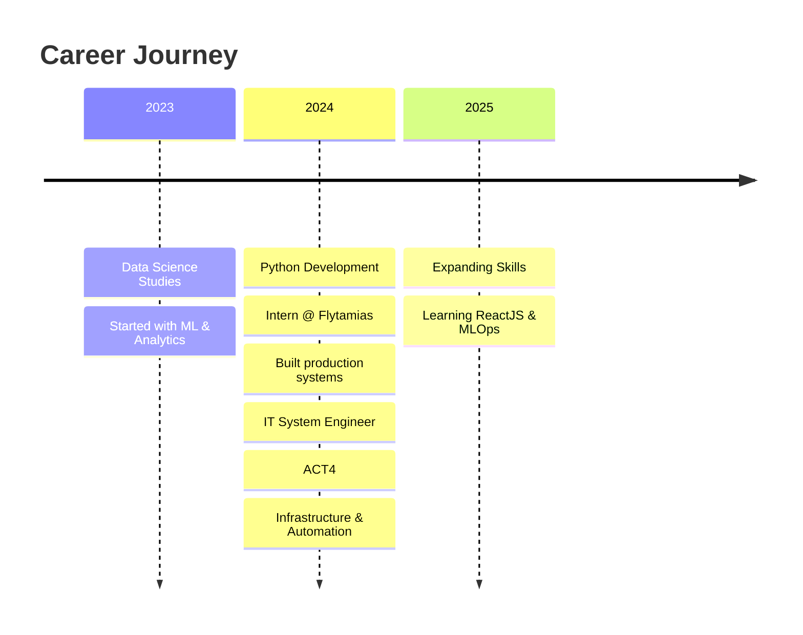

<div align="center">

<!-- Hero Section -->


<h3>
  
</h3>

<p>
  <a href="mailto:toandangquoc.45@gmail.com">
    
  </a>
  <a href="https://facebook.com/dangquoc.toan.1588/">
    
  </a>
  
</p>

</div>

<!-- About Section with Cards -->


### 🚀 About Me

```python
class ToanDangQuoc:
    def __init__(self):
        self.role = "Python Developer"
        self.experience = {
            "Flytamias": "Intern Python Developer",
            "ACT4": "IT System Engineer"
        }
        self.location = "Vietnam 🇻🇳"
        
    def skills(self):
        return {
            "development": ["Python", "FastAPI", "Django", "REST APIs"],
            "data": ["Pandas", "NumPy", "SQL", "ETL Pipelines"],
            "automation": ["Scripting", "Process Automation", "CI/CD"],
            "infrastructure": ["Linux", "Docker", "Networking", "System Admin"]
        }
    
    def current_focus(self):
        return {
            "learning": ["ReactJS", "AI Agents", "MLOps"],
            "building": ["Data Pipelines", "Automation Tools", "Web Apps"]
        }
    
    @property
    def journey(self):
        return "Data Science → Python Developer → IT System Engineer 🎯"
```

<br clear="right"/>

---

<!-- Tech Stack with Visual Cards -->
<div align="center">

## 🛠️ Technical Skills

### 🔥 Core Technologies

<table>
<tr>
  <td align="center" width="20%">
    
    <br><b>Python</b>
  </td>
  <td align="center" width="20%">
    
    <br><b>React</b>
  </td>
  <td align="center" width="20%">
    
    <br><b>PostgreSQL</b>
  </td>
  <td align="center" width="20%">
    
    <br><b>Docker</b>
  </td>
  <td align="center" width="20%">
    
    <br><b>Linux</b>
  </td>
</tr>
</table>

### 💻 Development Stack

**Languages & Frameworks**
```
Python    ████████████████████░  95%    FastAPI • Django • Flask
JavaScript ███████████████░░░░░  75%    React • Node.js
SQL       ████████████████░░░░  80%    PostgreSQL • MySQL
```

**Data & Analytics**
- **Data Processing:** Pandas • NumPy • SciPy • Polars
- **Visualization:** Matplotlib • Plotly • Seaborn • Power BI
- **Big Data:** Apache Spark • Kafka • Airflow
- **ML/AI:** scikit-learn • PyTorch • TensorFlow • OpenCV

**DevOps & Infrastructure**
- **Containerization:** Docker • Docker Compose
- **Version Control:** Git • GitHub • GitLab
- **CI/CD:** GitHub Actions • Jenkins
- **Cloud & Tools:** AWS • Linux Administration • Nginx

**Databases & Storage**
- **Relational:** PostgreSQL • MySQL • SQLite
- **NoSQL:** MongoDB • Redis
- **Vector DB:** Pinecone • ChromaDB

</div>

---

<!-- GitHub Stats Section -->
<div align="center">

## 📊 GitHub Analytics

<p align="center">
  
  
</p>


</div>

---

<!-- Experience Section -->
<div align="center">

## 💼 Professional Experience

</div>

<table>
<tr>
<td width="50%" valign="top">

### 🐍 Python Developer
**Flytamias** • *Internship*

**Key Responsibilities:**
- Developed REST APIs with FastAPI/Django
- Built data pipelines for ETL processes
- Implemented automation scripts
- Collaborated on ML model deployment

**Tech Stack:** Python • FastAPI • PostgreSQL • Docker • Git

</td>
<td width="50%" valign="top">

### 🖥️ IT System Engineer
**ACT4** • *Current*

**Key Responsibilities:**
- System administration & maintenance
- Network infrastructure management
- Automation & scripting
- Technical support & troubleshooting

**Tech Stack:** Linux • Networking • Bash • Python • Docker

</td>
</tr>
</table>



---

<!-- Projects & Focus -->
<div align="center">

## 🔭 What I'm Working On

<table>
<tr>
<td width="33%" valign="top" align="center">

### 🌱 Learning
- ReactJS for Full-Stack
- AI Agents & LLMs
- MLOps Best Practices
- Cloud Architecture

</td>
<td width="33%" valign="top" align="center">

### 🚧 Building
- Data Analysis Tools
- Automation Workflows
- Web Applications
- System Integrations

</td>
<td width="33%" valign="top" align="center">

### 🎯 Exploring
- AI Automation
- Process Optimization
- DevOps Practices
- Open Source

</td>
</tr>
</table>

</div>

---

<!-- Skills Badges -->
<div align="center">

## 🏆 Core Competencies

### Programming & Development


### Data & Analytics


### DevOps & Infrastructure


</div>

---

<!-- Connect Section -->
<div align="center">

## 🤝 Let's Connect!

**🎯 Open to opportunities in:**

```
┌─────────────────────────────────────────────────────────┐
│  🐍 Python Developer    │  📊 Data Analyst              │
│  🌐 Network Engineer    │  🤖 ML/AI Engineer            │
│  ⚙️ DevOps Engineer     │  💼 Technical Consulting      │
└─────────────────────────────────────────────────────────┘
```

<p>
  <a href="mailto:toandangquoc.45@gmail.com">
    
  </a>
  <a href="https://facebook.com/dangquoc.toan.1588/">
    
  </a>
</p>

### 💡 Interested in collaborating on:

🔹 **Data Analytics Projects** • 🔹 **Automation Solutions** • 🔹 **System Integration** • 🔹 **Open Source Contributions**

---


<i>💻 "Turning data into insights, code into solutions" 💻</i>

</div>
