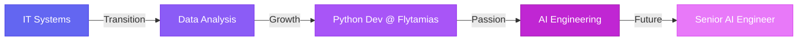

<div align="center">

<!-- Hero Section -->


<h3>
  
</h3>

<p>
  <a href="mailto:toandangquoc.45@gmail.com">
    
  </a>
  <a href="https://facebook.com/dangquoc.toan.1588/">
    
  </a>
  
</p>

</div>

<!-- About Section with Cards -->


### 🚀 About Me

```typescript
const toandq: Python Developer = {
  role: "AI Engineer",
  company: "Ex-Flytamias (Python Developer)",
  company: "ACT4 (IT System)",
  location: "Vietnam 🇻🇳",
  
  passion: [
    "🤖 AI Automation & Agents",
    "🧠 Deep Learning Systems", 
    "💼 Business AI Solutions",
    "🔬 Research & Innovation"
  ],
  
  currentFocus: {
    learning: ["LLMs", "AI Agents", "MLOps"],
    building: ["AI Workflows", "Automation Tools"],
    exploring: ["RAG Systems", "Production ML"]
  },
  
  funFact: "From IT Systems → Data Science → AI Engineering 🎯"
};
```

<br clear="right"/>

---

<!-- Tech Stack with Visual Cards -->
<div align="center">

## 🛠️ Technology Arsenal

### 🔥 Core Expertise

<table>
<tr>
  <td align="center" width="25%">
    
    <br><b>Python</b>
  </td>
  <td align="center" width="25%">
    
    <br><b>PyTorch</b>
  </td>
  <td align="center" width="25%">
    
    <br><b>TensorFlow</b>
  </td>
  <td align="center" width="25%">
    
    <br><b>Docker</b>
  </td>
</tr>
</table>

### 💻 Tech Stack

**AI/ML:** PyTorch • TensorFlow • Keras • scikit-learn • OpenCV • Transformers • LangChain

**Data:** Pandas • NumPy • Matplotlib • Plotly • SciPy • Apache Spark • Kafka

**MLOps:** MLflow • Docker • FastAPI • Airflow • Git • CI/CD

**Database:** PostgreSQL • MongoDB • Redis • Pinecone

**Tools:** Jupyter • VS Code • Postman • Power BI • Linux

</div>

---

<!-- GitHub Stats Section -->
<div align="center">

## 📊 GitHub Analytics

<p align="center">
  
  
</p>


</div>

---

<!-- Experience Timeline -->
<div align="center">

## 💼 Professional Journey

</div>



**🎯 Python Developer @ Flytamias** *(6 months)*
- ✅ Built production ML models for real business problems
- ✅ Designed end-to-end ML pipelines (ETL → Training → Deployment)
- ✅ Collaborated with cross-functional teams on AI integration

---

<!-- Activity Section -->
<div align="center">

## 🔭 Current Focus

<table>
<tr>
<td width="50%" valign="top">

### 🌱 Learning
- AI Agents & Autonomous Systems
- Advanced RAG Architectures
- Production LLM Deployment
- Enterprise MLOps Practices

</td>
<td width="50%" valign="top">

### 🚧 Building
- AI Automation Workflows
- Intelligent Process Optimization
- Custom ML Solutions
- Open Source Contributions

</td>
</tr>
</table>

</div>

---

<!-- Achievement Badges -->
<div align="center">

## 🏆 Highlights


</div>

---

<!-- Connect Section -->
<div align="center">

## 🤝 Let's Connect!

**Open to opportunities:** AI Engineer • ML Engineer • Research Engineer

<p>
  <a href="mailto:toandangquoc.45@gmail.com">
    
  </a>
  <a href="https://facebook.com/dangquoc.toan.1588/">
    
  </a>
</p>

### 💡 Interested in collaborating on:
🔹 AI Automation Projects • 🔹 Production ML Systems • 🔹 Research & Innovation • 🔹 Open Source

---


<i>⚡ "Building intelligent systems that transform businesses" ⚡</i>

</div>
